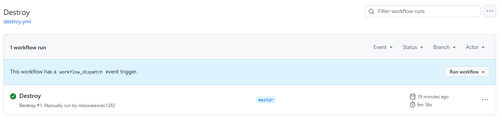
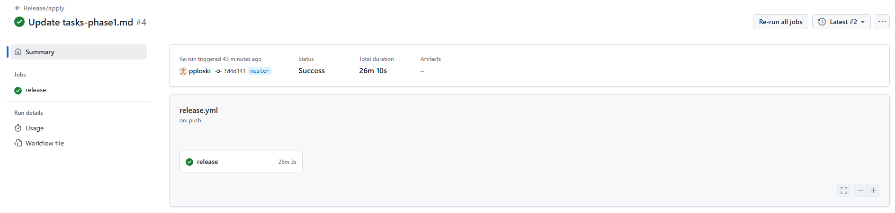
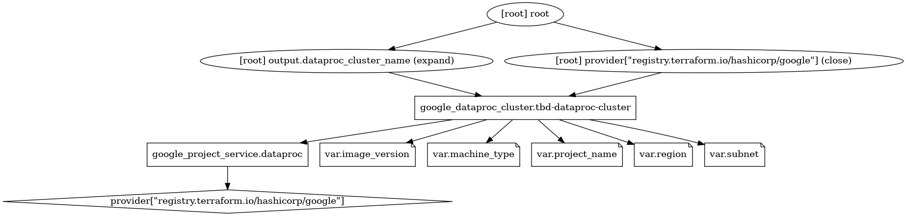
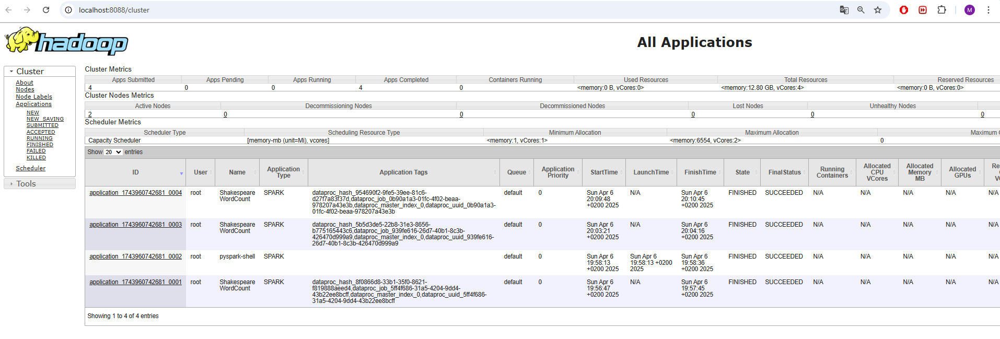

IMPORTANT ❗ ❗ ❗ Please remember to destroy all the resources after each work session. You can recreate infrastructure by creating new PR and merging it to master.


1. Authors:

   TBD - z10

   <https://github.com/mkowalewski1282/tbd-workshop-1/tree/master>

2. Follow all steps in README.md.

3. In boostrap/variables.tf add your emails to variable "budget_channels".

```hcl
variable "budget_channels" {
  type        = map(string)
  description = "Budget notification channels"
  default = {
    milosz-kowalewski = "01168891@pw.edu.pl"
    patryk-ploski     = "01168908@pw.edu.pl"
  }
}
```

4. From avaialble Github Actions select and run destroy on main branch.



5. Create new git branch and:
    1. Modify tasks-phase1.md file.

    2. Create PR from this branch to **YOUR** master and merge it to make new release.

    


6. Analyze terraform code. Play with terraform plan, terraform graph to investigate different modules.

    ***describe one selected module and put the output of terraform graph for this module here***

    

7. Reach YARN UI

   ***place the command you used for setting up the tunnel, the port and the screenshot of YARN UI here***
   ```hcl
   gcloud compute ssh tbd-cluster-m --project=tbd-2025l-9922 --zone=europe-west1-d --tunnel-through-iap -- -L 8088:localhost:8088
   ```

   

8. Draw an architecture diagram (e.g. in draw.io) that includes:
    1. VPC topology with service assignment to subnets
    2. Description of the components of service accounts
    3. List of buckets for disposal
    4. Description of network communication (ports, why it is necessary to specify the host for the driver) of Apache Spark running from Vertex AI Workbech

    ***place your diagram here***

9. Create a new PR and add costs by entering the expected consumption into Infracost
For all the resources of type: `google_artifact_registry`, `google_storage_bucket`, `google_service_networking_connection`
create a sample usage profiles and add it to the Infracost task in CI/CD pipeline. Usage file [example](https://github.com/infracost/infracost/blob/master/infracost-usage-example.yml)

   ***place the expected consumption you entered here***

   ***place the screenshot from infracost output here***

10. Create a BigQuery dataset and an external table using SQL

    ***place the code and output here***

    ***why does ORC not require a table schema?***

11. Find and correct the error in spark-job.py

    ***describe the cause and how to find the error***

12. Add support for preemptible/spot instances in a Dataproc cluster

    ***place the link to the modified file and inserted terraform code***


